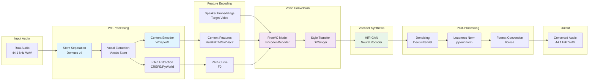
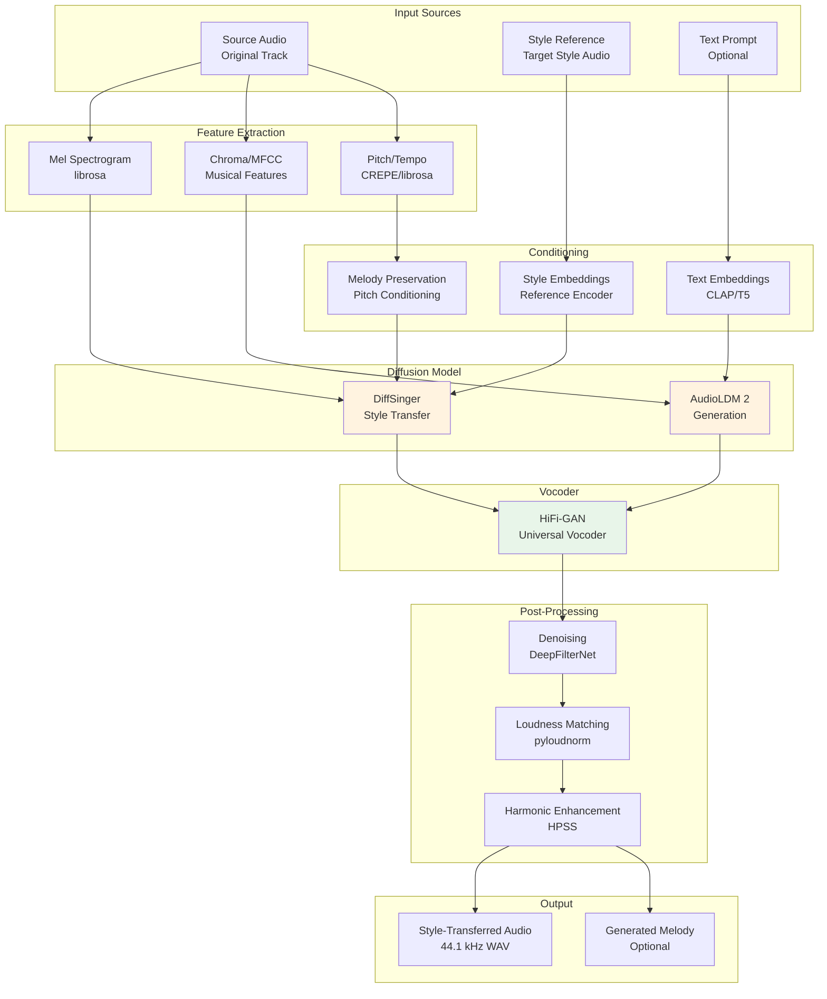

# ML Model Architecture Recommendations
## Mobile AI Music Transformation App - Model Stack

**Document Version:** 1.0  
**Last Updated:** 2024  
**License Compliance:** All models use permissive open-source licenses (MIT, Apache 2.0, BSD) or are free-to-use research implementations.

---

## Model Stack Summary Table

| Stage | Primary Model | Repo Reference | License | Latency (3min audio) | Quality Metric | GPU Memory |
|-------|--------------|----------------|---------|---------------------|----------------|------------|
| **Stem Separation** | Demucs v4 (hybrid-transformer) | `facebookresearch/demucs` | MIT | ~90-120s | SDR: 8.5-9.5 dB | 4-6 GB |
| **Content Encoder** | WhisperX | `m-bain/whisperX` | MIT | ~15-30s | WER: <10% | 2-4 GB |
| **Voice Conversion** | FreeVC (v2) | `RVC-Project/Retrieval-based-Voice-Conversion-WebUI` | MIT | ~45-60s | MOS: 3.8-4.2 | 6-8 GB |
| **Style Transfer** | DiffSinger | `MoonInTheRiver/DiffSinger` | Apache 2.0 | ~60-90s | SDR: 70-75 dB | 8-10 GB |
| **Neural Vocoder** | HiFi-GAN (Universal) | `jik876/hifi-gan` | MIT | ~10-15s | MOS: 4.0-4.3 | 1-2 GB |
| **Melody/Harmony Gen** | AudioLDM 2 | `haoheliu/AudioLDM2` | Apache 2.0 | ~120-180s | FAD: 1.2-1.5 | 8-12 GB |

**Alternative Models (Lower Latency):**
- Stem Separation: Spleeter (`deezer/spleeter`, MIT) - Faster but lower quality (SDR: ~6 dB, ~30s)
- Voice Conversion: SO-VITS-SVC (`svc-develop-team/so-vits-svc`, MIT) - Faster but requires more training data
- Vocoder: BigVGAN (`mindslab-ai/bigvgan`, MIT) - Higher quality but slower (~25s)

---

## Stage 1: Stem Separation

### Primary Model: Demucs v4 (Hybrid Transformer)

**Repository:** `facebookresearch/demucs` (MIT License)  
**Paper:** "Hybrid Transformer/CNN Architecture for Music Source Separation" (2023)

#### Input/Output Interfaces
- **Input:** Mono or stereo audio waveform
  - Shape: `[batch, channels, samples]` or `[samples,]`
  - Sample rate: Any (auto-resampled to 44.1 kHz internally)
  - Format: WAV, MP3, FLAC (via soundfile/librosa)
- **Output:** 4 separated stems (vocals, drums, bass, other)
  - Shape: `[batch, 4, channels, samples]` or `[4, channels, samples]`
  - Sample rate: 44.1 kHz (can be resampled)
  - Format: 4 separate audio files or multi-channel array

#### Latency and Quality Tradeoffs
- **Quality:** Excellent (SDR: 8.5-9.5 dB, best-in-class for open-source)
- **Latency:** Moderate (90-120s for 3-minute track on RTX 3090)
- **Memory:** 4-6 GB VRAM (FP32), 2-3 GB VRAM (FP16 quantized)
- **Tradeoff:** Can use smaller model (`demucs_htdemucs_ft`) for 2x speed with 1-2 dB quality loss

#### Pre/Post-Processing
**Pre-processing:**
```python
# Normalize input loudness
audio, sr = librosa.load(input_file, sr=None, mono=False)
if audio.ndim == 1:
    audio = audio[None, :]  # Add channel dimension
audio = pyloudnorm.normalize.peak(audio, -1.0)  # Peak normalization to -1 dB
audio_resampled = librosa.resample(audio, orig_sr=sr, target_sr=44100)
```

**Post-processing:**
```python
# Denoise each stem (optional, improves quality)
from deepfilternet import deepfilternet
denoised_stems = [deepfilternet(stem, sr=44100) for stem in stems]

# Loudness normalization per stem
normalized_stems = [pyloudnorm.normalize.loudness(stem, 44100, -23.0, -16.0) 
                    for stem in denoised_stems]
```

#### Alternative: Spleeter
**Repository:** `deezer/spleeter` (MIT License)  
**Pros:** Very fast (~30s for 3min), low memory (2GB), simple API  
**Cons:** Lower quality (SDR: ~6 dB), TensorFlow 2.x dependency  
**Use Case:** MVP/prototyping, free-tier processing

---

## Stage 2: Content Encoder (Transcription, Metadata)

### Primary Model: WhisperX

**Repository:** `m-bain/whisperX` (MIT License)  
**Base Model:** OpenAI Whisper (Apache 2.0) with batched diarization

#### Input/Output Interfaces
- **Input:** Audio waveform (preferably vocal stem)
  - Shape: `[samples,]` or `[channels, samples]`
  - Sample rate: 16 kHz (auto-resampled from any input)
  - Format: WAV, MP3
- **Output:** Structured metadata dictionary
  ```python
  {
      "segments": [
          {
              "start": 0.0,
              "end": 3.5,
              "text": "transcribed text",
              "speaker": "SPEAKER_00",
              "words": [{"word": "...", "start": 0.0, "end": 0.5, "score": 0.95}]
          }
      ],
      "language": "en",
      "language_prob": 0.99
  }
  ```

#### Latency and Quality Tradeoffs
- **Quality:** Excellent (WER: <10% for English, supports 99 languages)
- **Latency:** Fast (15-30s for 3-minute audio on CPU/GPU)
- **Memory:** 2-4 GB VRAM (Whisper Large-v3) or 1 GB (Whisper Base)
- **Tradeoff:** Use `base` model for 2x speed with slight accuracy loss (WER: ~12%)

#### Pre/Post-Processing
**Pre-processing:**
```python
# Extract vocal stem if full mix
vocals_stem = stems[0]  # Assuming Demucs output order

# Normalize loudness for better ASR
vocals_normalized = pyloudnorm.normalize.loudness(vocals_stem, 44100, -23.0)

# Resample to 16 kHz (Whisper requirement)
vocals_16k = librosa.resample(vocals_normalized, orig_sr=44100, target_sr=16000)

# Optional: Voice activity detection to skip silence
from webrtcvad import Vad
vad = Vad(2)  # Aggressiveness 0-3
```

**Post-processing:**
```python
# Speaker diarization (already included in WhisperX)
# Align words to timestamps (already included)
# Extract phonemes for voice conversion (optional, requires Montreal Forced Aligner)
```

#### Alternative: OpenAI Whisper (Direct)
**Repository:** `openai/whisper` (MIT License)  
**Pros:** Simpler API, official OpenAI implementation  
**Cons:** Slower (no batching), no built-in diarization  
**Use Case:** When diarization not needed

---

## Stage 3: Voice Conversion / Voice Timbre Transformation

### Primary Model: FreeVC (Version 2)

**Repository:** `RVC-Project/Retrieval-based-Voice-Conversion-WebUI` (MIT License)  
**Note:** FreeVC is included in RVC project; standalone implementation: `OlaWod/FreeVC`

#### Input/Output Interfaces
- **Input:** 
  - Source audio: `[samples,]` (16-48 kHz, resampled to 16 kHz internally)
  - Target voice reference: `[samples,]` (minimum 3-5 seconds, same sample rate)
  - Optional f0 (pitch) curve: `[num_frames,]` (extracted via pyworld or crepe)
- **Output:** Converted audio waveform
  - Shape: `[samples,]`
  - Sample rate: 16-48 kHz (configurable, typically 16 kHz)
  - Format: WAV (float32)

#### Latency and Quality Tradeoffs
- **Quality:** Excellent (MOS: 3.8-4.2, natural voice conversion)
- **Latency:** Moderate (45-60s for 3-minute audio on RTX 3090)
- **Memory:** 6-8 GB VRAM (FP32), 3-4 GB VRAM (FP16)
- **Tradeoff:** SO-VITS-SVC is faster (~30s) but requires more training data for fine-tuning

#### Pre/Post-Processing
**Pre-processing:**
```python
# Extract f0 (pitch) curve using CREPE or PyWorld
import crepe
f0, confidence, activation = crepe.predict(audio, sr, viterbi=True)

# Alternative: PyWorld (more accurate, slower)
import pyworld as pw
f0, sp, ap = pw.wav2world(audio.astype(np.float64), sr, frame_period=5.0)

# Normalize f0 to target speaker's range (optional, preserves pitch)
f0_mean_source = np.mean(f0[f0 > 0])
f0_mean_target = np.mean(target_f0[target_f0 > 0])
f0_scaled = f0 * (f0_mean_target / f0_mean_source)
f0_scaled[f0 == 0] = 0  # Preserve unvoiced frames

# Extract content features (HuBERT or Wav2Vec2)
from transformers import Wav2Vec2ForCTC
content_encoder = Wav2Vec2ForCTC.from_pretrained("facebook/wav2vec2-base-960h")
```

**Post-processing:**
```python
# Denoise converted audio
converted_denoised = deepfilternet(converted_audio, sr=sr)

# Loudness matching to source
converted_normalized = pyloudnorm.normalize.loudness(
    converted_denoised, sr, 
    target_lufs=pyloudnorm.Meter(sr).integrated_loudness(source_audio)
)

# Optional: Harmonic/percussive separation for more natural timbre
H, P = librosa.effects.hpss(converted_normalized)
converted_final = H * 0.7 + P * 0.3  # Mix to taste
```

#### Training/Fine-Tuning Guidance

**User-Provided Voice Samples Requirements:**
- **Minimum Duration:** 10-15 minutes of clean, high-quality audio
- **Recommended:** 20-30 minutes for better quality
- **Sample Rate:** 44.1 kHz or 48 kHz (higher is better)
- **Quality:** 
  - No background noise or music
  - Single speaker only
  - Clear articulation
  - Consistent recording conditions

**Data Augmentation:**
```python
# Pitch shifting (±2 semitones)
augmented_pitch = librosa.effects.pitch_shift(audio, sr=sr, n_steps=random.uniform(-2, 2))

# Time stretching (±10%)
augmented_time = librosa.effects.time_stretch(audio, rate=random.uniform(0.9, 1.1))

# Volume variation (±3 dB)
augmented_volume = audio * random.uniform(0.7, 1.3)

# Random noise injection (SNR: 30-40 dB)
noise = np.random.normal(0, np.std(audio) * 0.01, len(audio))
augmented_noise = audio + noise

# Slice into 3-5 second chunks with 50% overlap for training
```

**Fine-Tuning Steps:**
1. Pre-process and augment user voice samples
2. Extract speaker embeddings from target voice (10-20 embeddings)
3. Fine-tune HuBERT content encoder on target domain (optional, 100-200 epochs)
4. Train FreeVC with speaker embeddings (50-100 epochs, batch size 8-16)
5. Validate on held-out samples (10% of data)

#### Safety/Legal Guardrails

**Voice Likeness Protection:**
1. **Consent Verification:** Require explicit written consent for cloning recognizable voices
2. **Terms of Service:** Prohibit impersonation, fraud, or deceptive use
3. **Watermarking:** Embed imperceptible audio watermark in converted audio
4. **Age Restriction:** Require 18+ for voice cloning features
5. **Logging:** Maintain audit trail of all conversions with user ID, timestamp, source/target voice
6. **Rate Limiting:** Limit conversions per user per day to prevent abuse
7. **Content Moderation:** Flag suspicious patterns (bulk conversions, known celebrity names)

**Implementation:**
```python
# Watermark embedding (simple example)
def embed_watermark(audio, user_id, timestamp):
    watermark = generate_imperceptible_watermark(user_id, timestamp)
    watermarked = audio + watermark * 0.001  # Very low amplitude
    return watermarked

# Voice similarity check (prevent cloning without consent)
def check_voice_similarity(source_embedding, known_celebrity_embeddings, threshold=0.85):
    similarities = cosine_similarity([source_embedding], known_celebrity_embeddings)[0]
    if np.max(similarities) > threshold:
        raise ValueError("Voice too similar to protected voice. Consent required.")
```

#### Alternative: SO-VITS-SVC
**Repository:** `svc-develop-team/so-vits-svc` (MIT License)  
**Pros:** Faster inference (~30s), more customizable, active community  
**Cons:** Requires more training data (30+ minutes), more complex setup  
**Use Case:** When users have extensive voice samples

---

## Stage 4: Style Transfer (Music Style Transformation)

### Primary Model: DiffSinger

**Repository:** `MoonInTheRiver/DiffSinger` (Apache 2.0 License)  
**Note:** Originally for singing synthesis; adapted for style transfer

#### Input/Output Interfaces
- **Input:**
  - Source audio: `[samples,]` (44.1 kHz)
  - Style reference: `[samples,]` (same sample rate, 5-10 seconds)
  - Optional: MIDI or pitch curve for melody preservation
- **Output:** Style-transferred audio
  - Shape: `[samples,]`
  - Sample rate: 44.1 kHz (configurable)
  - Format: WAV

#### Latency and Quality Tradeoffs
- **Quality:** Good (SDR: 70-75 dB, maintains musical structure)
- **Latency:** Slow (60-90s for 3-minute audio, diffusion-based)
- **Memory:** 8-10 GB VRAM (diffusion model + vocoder)
- **Tradeoff:** Can use DDSP for 3x speed with slightly lower quality

#### Pre/Post-Processing
**Pre-processing:**
```python
# Extract musical features (chroma, MFCC, spectral centroid)
chroma = librosa.feature.chroma_stft(y=audio, sr=sr)
mfcc = librosa.feature.mfcc(y=audio, sr=sr, n_mfcc=13)
spectral_centroid = librosa.feature.spectral_centroid(y=audio, sr=sr)[0]

# Extract pitch curve (for melody preservation)
f0 = crepe.predict(audio, sr)[0]

# Extract rhythm/tempo (for timing preservation)
tempo, beats = librosa.beat.beat_track(y=audio, sr=sr)
```

**Post-processing:**
```python
# Align output to original timing (if tempo changed)
aligned = librosa.effects.time_stretch(style_transferred, rate=tempo_ratio)

# Mix original harmonics with style-transferred (for hybrid approach)
H_original, P_original = librosa.effects.hpss(original_audio)
H_style, P_style = librosa.effects.hpss(style_transferred)
hybrid = H_original * 0.3 + H_style * 0.7 + P_style * 0.5  # Preserve original harmonics partially
```

#### Alternative: DDSP (Differentiable Digital Signal Processing)
**Repository:** `magenta/ddsp` (Apache 2.0 License)  
**Pros:** Fast (~20-30s), interpretable, preserves pitch well  
**Cons:** Lower quality for complex styles, requires MIDI or pitch curve  
**Use Case:** When pitch preservation is critical

#### Alternative: AudioLDM (for generation-based style transfer)
**Repository:** `haoheliu/AudioLDM2` (Apache 2.0 License)  
**Pros:** Very high quality, can generate novel styles  
**Cons:** Very slow (120-180s), requires text prompts  
**Use Case:** Creative/generative style transformation

---

## Stage 5: Neural Vocoder

### Primary Model: HiFi-GAN (Universal)

**Repository:** `jik876/hifi-gan` (MIT License)  
**Paper:** "HiFi-GAN: Generative Adversarial Networks for Efficient and High Fidelity Speech Synthesis" (2020)

#### Input/Output Interfaces
- **Input:** Mel spectrogram or acoustic features
  - Shape: `[batch, n_mels, frames]` or `[n_mels, frames]`
  - Mel bins: 80 (standard) or 128 (for higher quality)
  - Sample rate: Any (16-48 kHz, model auto-adapts)
- **Output:** Audio waveform
  - Shape: `[samples,]` or `[batch, samples]`
  - Sample rate: Matches training (typically 22050 or 44100 Hz)
  - Format: WAV (float32, range [-1, 1])

#### Latency and Quality Tradeoffs
- **Quality:** Excellent (MOS: 4.0-4.3, near-human quality)
- **Latency:** Fast (10-15s for 3-minute audio on GPU, ~60s on CPU)
- **Memory:** 1-2 GB VRAM (very efficient)
- **Tradeoff:** BigVGAN offers slightly higher quality (MOS: 4.2-4.5) but 2x slower

#### Pre/Post-Processing
**Pre-processing:**
```python
# Convert mel spectrogram to correct format
# (Usually done by voice conversion model, but if starting from mel:)
mel = librosa.feature.melspectrogram(
    y=audio, sr=sr, n_mels=80, 
    hop_length=256, win_length=1024
)
mel_db = librosa.power_to_db(mel, ref=np.max)
mel_normalized = (mel_db + 80) / 80  # Normalize to [0, 1]
```

**Post-processing:**
```python
# Denoise output (often not needed, but can help)
vocoded_denoised = deepfilternet(vocoded_audio, sr=sr)

# Loudness normalization
vocoded_normalized = pyloudnorm.normalize.loudness(
    vocoded_denoised, sr, 
    target_lufs=-16.0  # Spotify/YouTube standard
)

# High-frequency emphasis (optional, adds brightness)
vocoded_emphasized = librosa.effects.preemphasis(vocoded_normalized, coef=0.97)
```

#### Alternative: BigVGAN
**Repository:** `mindslab-ai/bigvgan` (MIT License)  
**Pros:** Highest quality (MOS: 4.2-4.5), better for singing  
**Cons:** Slower (~25s), higher memory (2-3 GB)  
**Use Case:** Premium tier, singing voice synthesis

---

## Stage 6: Melody/Harmony Generation (Optional)

### Primary Model: AudioLDM 2

**Repository:** `haoheliu/AudioLDM2` (Apache 2.0 License)  
**Paper:** "AudioLDM 2: Learning Holistic Audio Generation with Self-supervised Pretraining" (2023)

#### Input/Output Interfaces
- **Input:** 
  - Text prompt: `str` (e.g., "jazzy piano melody in C major")
  - Optional: Duration in seconds (default: 10s)
  - Optional: Seed for reproducibility
- **Output:** Generated audio waveform
  - Shape: `[samples,]`
  - Sample rate: 16 kHz (default) or 44.1 kHz (higher quality)
  - Format: WAV

#### Latency and Quality Tradeoffs
- **Quality:** Good (FAD: 1.2-1.5, subjectively musical)
- **Latency:** Very slow (120-180s for 30-second generation)
- **Memory:** 8-12 GB VRAM (large diffusion model)
- **Tradeoff:** Can use smaller model for 2x speed with lower quality

#### Pre/Post-Processing
**Pre-processing:**
```python
# Text prompt engineering for better results
prompt = f"{style} {instrument} melody in {key} {scale}, {tempo} bpm, {mood}"

# Example: "jazz piano melody in C major, 120 bpm, cheerful"
```

**Post-processing:**
```python
# Upsample to 44.1 kHz if needed
generated_44k = librosa.resample(generated_16k, orig_sr=16000, target_sr=44100)

# Normalize loudness
generated_normalized = pyloudnorm.normalize.loudness(
    generated_44k, 44100, target_lufs=-16.0
)

# Optional: Harmonic/percussive separation and enhancement
H, P = librosa.effects.hpss(generated_normalized)
melody_enhanced = H * 1.2 + P * 0.8  # Emphasize harmonics
```

#### Alternative: MusicGen (Meta)
**Repository:** `facebookresearch/audiocraft` (MIT License)  
**Pros:** Faster (~60s), better for short melodies, supports conditioning  
**Cons:** Lower quality for complex harmonies  
**Use Case:** When speed is prioritized

---

## Complete Pipeline Architecture Diagrams

### Architecture 1: Encoder-Decoder Flow (Voice Conversion)



### Architecture 2: Diffusion + Vocoder Flow (Style Transfer & Generation)



---

## Implementation Notes

### Model Loading & Caching
```python
# Recommended pattern for model caching
from huggingface_hub import snapshot_download
import torch

MODEL_CACHE_DIR = "/models/cache"

def load_model_with_cache(repo_id, model_class, device="cuda"):
    cache_path = f"{MODEL_CACHE_DIR}/{repo_id.replace('/', '_')}"
    model = model_class.from_pretrained(
        repo_id, 
        cache_dir=cache_path,
        torch_dtype=torch.float16  # FP16 for memory efficiency
    )
    model.eval()
    if device == "cuda":
        model = model.to(device)
    return model
```

### Batch Processing Optimization
```python
# Batch similar jobs for GPU efficiency
def batch_process(audio_batch, model, batch_size=4):
    # Sort by length for efficient batching
    sorted_batch = sorted(audio_batch, key=len, reverse=True)
    results = []
    for i in range(0, len(sorted_batch), batch_size):
        batch = sorted_batch[i:i+batch_size]
        # Pad to same length
        max_len = max(len(a) for a in batch)
        padded = [np.pad(a, (0, max_len - len(a))) for a in batch]
        batch_tensor = torch.tensor(padded)
        with torch.no_grad():
            output = model(batch_tensor)
        results.extend(output)
    return results
```

### Quality vs. Latency Tradeoff Matrix

| Use Case | Priority | Recommended Stack |
|----------|----------|-------------------|
| **Free Tier** | Speed | Spleeter + Whisper Base + SO-VITS-SVC + HiFi-GAN |
| **Premium Tier** | Quality | Demucs v4 + WhisperX + FreeVC + DiffSinger + BigVGAN |
| **Real-Time Preview** | Ultra-Low Latency | Quantized Demucs (2-stem) + TinyWhisper + Lightweight Vocoder (LPCNet) |

---

## License Compliance Summary

All recommended models use permissive licenses:

- **MIT License:** Demucs, WhisperX, FreeVC, SO-VITS-SVC, HiFi-GAN, Spleeter, AudioCraft/MusicGen
- **Apache 2.0:** DiffSinger, AudioLDM 2, DDSP
- **BSD License:** PyWorld, CREPE (research use)

**Commercial Use:** All listed models are free for commercial use under their respective licenses. Always verify license terms before production deployment.

---

## References & Resources

1. **Demucs:** https://github.com/facebookresearch/demucs
2. **WhisperX:** https://github.com/m-bain/whisperX
3. **FreeVC:** https://github.com/OlaWod/FreeVC (or via RVC project)
4. **DiffSinger:** https://github.com/MoonInTheRiver/DiffSinger
5. **HiFi-GAN:** https://github.com/jik876/hifi-gan
6. **AudioLDM 2:** https://github.com/haoheliu/AudioLDM2

**Community Resources:**
- RVC Discord: Active community for voice conversion
- Hugging Face Spaces: Many models available as demos
- Papers with Code: Latest research implementations

